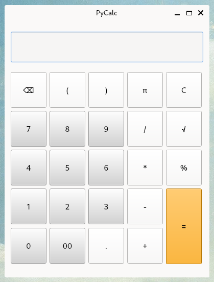

# pyqt_desktop_calculator

Project to familiarise myself with PyQt.

I followed the tutorial at https://realpython.com/python-pyqt-gui-calculator/ to create a simple calculator.

## Requirements
- Python 3.7+
- pip
- pipenv

## Installation

To install dependencies from `Pipfile`, run:

```
pipenv install
```

## Usage

To run the Hello World example, enter `pipenv shell` and run:

```
python hello.py
```


To run the calculator, enter `pipenv shell` and run:

```
python pycalc.py
```




## TODO
- [ ] Add more calculator functionality i.e. pi, sqrt, etc.
- [ ] Remove `eval` from `evaluateExpression()` function as this is insecure
- [ ] Make exception handling more robust
- [ ] Add tests
